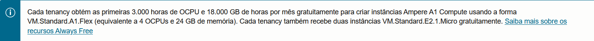

# Servidor de Minecraft Java/Bedrock GRATUITO (Oracle Cloud)

Fiz esse tutorial apenas para tornar esse conhecimento mais acessível, não sou nenhum especiaista no assunto, mas gostaria de deixar a minha contribuição para que outros também possam jogar com os amigos sem que haja a necessidade de pagar (e caro) por isso.

Esse servidor é capaz de comportar um número razoável de jogadores ao mesmo tempo. Além disso, é perfeitamente possível adicionar mods (posteriormente adicionarei essa seção ao tutorial).

As instruções a seguir não são tão simples, mas basta segui-lás com atenção e o servidor estará pronto.

## Etapas:
1 - Criar uma conta e configurar o ambiente da OCI.

2 - Configurar o ambiente do SO.

3 - Instalar e configurar o Servidor de Minecraft.

### Saiba que há diferentes maneiras de criar/administrar um Servidor de Minecraft. Vou listar as que serão abordadas nesse tutorial:
1 - [Crafty](https://craftycontrol.com/) - (Recomendado)

2 - Instalação "crua" - (Recomendado apenas para testes rápidos)

Obs.:  
Sugiro fortemente que use o Crafty Controller para gerenciar os servidores, pois este pode ser administrado por um painel web:  
Veja: https://craftycontrol.com/

Para atualizar o Crafty:  
Veja: https://docs.craftycontrol.com/pages/getting-started/installation/linux/?h=update#updating-crafty

Caso opte por gerenciar manualmente, as intruções para isso estão contidas nesse texto, mas entenda que não é nada prático no dia-a-dia. Se optar pelo Crafty, siga todos os passos até 2.1, a partir dali consulte o guia do próprio Crafty Controller

## 1 - Criando e configurando uma instância Oracle Cloud

Acesse [https://cloud.oracle.com/](https://cloud.oracle.com/) e crie uma conta Oracle Cloud clicando em "Sing Up" e seguindo as instruções.

Para fazer login será necessário usar o app de autenticação "Oracle Mobile Authenticator".

Antes de prosseguir, saiba que será necessário cadastrar um cartão de crédito (explicarei o motivo depois), mas fique tranquilo(a), se tudo for feito corretamente, não havarão cobranças.

### 1.1 - Criando uma instância Oracle Cloud

Agora que a conta já foi criada, na página inicial, acesse [https://cloud.oracle.com/compute/instances](https://cloud.oracle.com/compute/instances) e clique em "Criar Instância" para dar início ao processo.

Escolha o nome que quiser e evite modificar as outras configurações caso não saiba o que está fazendo.

Vá para "Imagem e forma", clique em "Editar" e depois em "Alterar iamgem", clique em "Ubuntu" e escolha "Canonical Ubuntu 24.04" (hoje é a mais recente) e clique em "Aplicar" (o sistema operacional precisa ser Linux, o Windows é pago). Eu prefiro o Ubuntu ao Oracle Linux, mas na prática eu acredito que não faça tanta diferença.

> [!Important]
> Observando o aviso, pode-se perceber que a melhor opção gratuita é a CPU Ampere (VM.Standard.A1.Flex). Use no máximo 4 OCPUs e 24GB de RAM para que não haja problemas futuros com cobranças.

⁠⁠Crie uma instância com a CPU Ampere (VM.Standard.A1.Flex) (no máximo 4 núcleos e 24GB de RAM).

> [!NOTE]
> Se você não cadastrou um cartão de crédito, certamente recebeu uma mensagem avisando sobre a indisponibilidade dessa configuração.

Agora é necessário baixar a chave SSH, ela será usada para fazer a conexão com o servidor. Clique em "Save private key" e cuidado para não perder esse arquivo.

A útima etapa da configuração da instância será "Volume de inicialização". Por padrão o tamanho do volume é de 50GB, mas é possível alterar clicando em "Especifique um tamanho do volume de inicialização personalizado". 

> [!NOTE]
> É possível usar até 200GB (somando todas as suas instâncias, caso tenha mais de uma) gratuitamente, por mais que apareça um valor no canto inferior direito da tela. Pode-se verificar isso na [Calculadora de Preços da Oracle Cloud](https://www.oracle.com/br/cloud/costestimator.html), onde há a seguinte afirmação:
> 
> 

Por fim, clique em "Criar" para finalizra a criação da instância.

### 1.2 - Configurando a sub-rede

Ainda no painel da Oracle, é necessário configurar as regras da rede para permitir o tráfego TCP/UDP na porta 25565 (Minecraft Java) ou 19132 (Minecraft Bedrock).

Obs.: O Java usa por padrão a porta 25565 para IPv4 e protocolo TCP. Já o Bedrock usa por padrão a porta 19132 para IPv4 e protocolo UDP. Lembre-se de que a porta usada pode ser alterada no arquivo server.properties e também é necessário alterar as regras de firewall da OCI e do Linux (UFW).

Ná página inicial, clique no botão de menu (3 traços) no canto superior esquerdo, vá em "Rede", depois em "Redes virtuais na nuvem". Já no painel de redes, clique na VCN disponível e na aba de "Listas de segurança" selecione a que está disponível (Default Security List for vcn-xxxxxxxx-xxxx). 

Agora clique em "Adicionar Eegras de Entrada" e configure da seguinte forma:

 

| CIDR de Origem: | Protocolo IP: | Intervalo de Portas de Origem: | Intervalo de Portas de Destino:
|-----------|-----|---------------|------------|
| 0.0.0.0/0 | TCP | Todos | 25565 (Java) |
| 0.0.0.0/0 | UDP | Todos | 19132 (Bedrock) |

Descrição: (Escreva o que quiser para identificar a regra)

Clique em "+ Outra Regra de Entrada" para configurar a regra para UDP. Por fim, clique em "Adicionar Regras de Entrada" para concluir.

## 2 - Se conectando à instância Oracle Cloud

Com a instância perfeitamente configurada e as regras de rede definidas, basta se conectar usando SSH.

Antes, verifique se a instância está em execução, caso esteja, clique em reinicializar para garantir que as regras de rede para as portas 25565/19132 foram aplicadas corretamente.

> [!Important]
> Quando for desligar uma instância, não clique em "Encerrar", isso vai deletá-la. Use "Interromper".

### 2.1 - Fazendo a conexão SSH

Para fazer a conexão com a instância é possível usar o próprio Terminal do Windows/Linux

> [!TIP]
> Eu gosto bastante de usar o [Termius](https://termius.com/download/windows), a interface é bem intuitiva, as chaves ficam salvas e, além disso, é possível usá-lo no celular.

Caso opte pelo Terminal/CMD, digite `ssh -i /endereço/da/chave/privada usuário@host-ip ` 
Ex.: `"C:\Users\mathe\OneDrive\Área de Trabalho\Matheus\Scripts\Ampere-VM\new-ampere-vm.key" ubuntu@168.75.73.119"` Talvez seja necessário mudar as permissões do arquivo da chave. 

Obs.: (CTRL + SHIFT + C copia o enderço do arquivo).

Caso opte por usar o Termius, basta configurar um novo host incluindo o IP da instância (disnponível na página da mesma), o nome de usuário (sempre "ubuntu" para instâcncias com esse OS) e a chave SSH (abra o arquivo .key com o bloco de notas -> CTRL + A para selecionar tudo e CTRL + C para copiar -> CTRL + V para colar na aba "Key" no Termius).

Agora resta apenas instalar e configurar o prórprio Minecraft Server, mas antes disso, é interessante ter um certo conhecimento dos comandos do terminal.

`ls: Lista o conteúdo de um diretório.`

`cd: Navega entre diretórios.`
`Exemplo: cd /caminho/do/diretorio`

`cd ..: Volta um nível no diretório.`

`cd: Vai para o diretório pessoal do usuário`

`mkdir: Cria um novo diretório.`
`Exemplo: mkdir nome_do_diretorio`

`rm: Remove arquivos ou diretórios.`
`Exemplo: rm nome_do_arquivo`

`rm -r: Remove recursivamente (todos o conteúdo dentro da pasta)`

`cp: Copia arquivos ou diretórios.`
`Exemplo: cp origem destino`

`mv: Move ou renomeia arquivos ou diretórios.`
`Exemplo: mv origem destino`

`nano: Abre o editor de texto Nano.`
`Exemplo: nano nome_do_arquivo`

`cat: Exibe o conteúdo de um arquivo.`
`Exemplo: cat nome_do_arquivo`

`sudo: Executa um comando com privilégios de superusuário.`
`Exemplo: sudo nome_do_comando`

`apt: Gerenciador de pacotes para instalar, atualizar e remover software no Ubuntu.`
`Exemplo: sudo apt install nome_do_pacote`

`wget: Baixa arquivos da internet.`
`Exemplo: wget URL_do_arquivo`

### 2.2 - Instalando os pacotes necessários

Primeiro atualize os pacotes do sistema com: `sudo apt update && sudo apt upgrade -y`

Agora instale o Java (somente para o Minecraft Java) -> Pule essa etapa se pretente instalar apenas o Bedrock

> Minecraft 1.17 ou superior → Java 17 (recomendado)

`sudo apt install openjdk-17-jdk`

> Minecraft 1.16 ou inferior → Java 8 (recomendado)

`sudo apt install openjdk-8-jdk`

Instale o UFW (Uncomplicated Firewall) com `sudo apt install ufw` e libere as portas 25565 para o Java e ou 19132 para o Bedrock com `sudo ufw allow 25565/tcp` e `sudo ufw allow 19132/udp`. Reinicie o firewall para aplicar as mudanças com `sudo ufw reload`. Verifique o estado do firewall com `sudo systemctl status ufw`. 

> [!Important]
> Como o processador disponibilizado pela Oracle não é x86-64 (é arm), o Minecraft Bedrock precisa de uma camada de compatibilidade para funcionar:
> Instale o Box64: `sudo apt update && sudo apt install box64-rpi4arm64 -y`

> [!TIP]
> Para facilitar a instalação manual, criei um script que pode agilizar o processo, o [EasyMCServer](https://github.com/math1p/EasyMCServer/releases) - Disponínivel para Windows atráves do .exe e para Linux através do PyPI.
> Primeiro atualize o pip com `python3 -m pip install --upgrade pip`, logo em seguida instale com `pip install easymcserver` e rode com `easymc`. Depois de instalar, pule para o passo 4 e siga as instruções. Caso prefira instalar manualmente, ignore essa dica e continue seguindo as instruções

### 2.3 - Criando os diretórios - (Apenas para instação manual)

Sugiro organizar dessa maneira: "`/Minecraft-Bedrock-Server` ou `/Minecraft-Java-Server`", mas sinta-se livre para nomear de acordo com a sua preferência:

> [!TIP]
> Tenha certeza de que está no diretório correto, use: `pwd` para ver em qual diretório está e `cd` para retornar ao diretório pessoal.

Acesse o diretório criado com `mkdir nome_escolhido`
Ex.: `mkdir Minecraft-Bedrock-Server` ou `mkdir Minecraft-Java-Server`

Crie um diretório para os backups do mundo com: `mkdir Backups`

## 3 - Instalando o servidor de Minecraft Java/Bedrock

> [!TIP]
> Use `cd` para navegar entre os diretórios.

Para instalar o servidor, acesse [Java](https://www.minecraft.net/en-us/download/server) (apenas um link) ou [Bedrock](https://www.minecraft.net/pt-br/download/server/bedrock) (Software do servidor dedicado do Minecraft para Ubuntu (Linux)) e clique com o botão direito para copiar o link

Agora execute o comando “wget (link copiado)”. 
Ex.: `wget https://piston-data.mojang.com/v1/objects/4707d00eb834b446575d89a61a11b5d548d8c001/server.jar`

Depois disso, basta descompactar o arquivo do servidor `unzip nome_do_arquivo` (caso não esteja instalado, use `sudo apt install unzip`);

Aceitar o EULA na versão java `sudo nano eula.txt`,

Configurar o arquivo [server.properties](https://minecraft.fandom.com/pt/wiki/Server.properties) (serve para configurar o nome do mundo, modo de jogo, dificuldade e etc) e executar com `./(nome-do-arquivo)`para o bedrock e com `java -Xmx8G -Xms2G -jar minecraft_server.(versão).jar nogui`.

> [!TIP]
> Use `java -Xmx(máximo de memória em GB que o servidor pode usar)G - Xms(mínimo de memória em GB que o servidor pode usar)G. Lembre-se que a memória é alocada dinâmicamente a partir do valor mínimo definido (Xms) até o valor máximo (Xmx) em GB caso use "G" ou em MB caso use "M"`
> 
> Ex.: `-Xmx16G - Xms1G - jar minecraft_server.(versão).jar nogui`.
>
> Verifique os comandos em: https://minecraft.wiki/w/Tutorials/Setting_up_a_server
>
> Lembrando que a instância tem no máximo 24GB de RAM. Sempre reserve uma parte para o sistema.

> Use "stop" para encerrar o servidor.

## 4 - Configurar o servidor de Minecraft Java/Bedrock

Edite o arquivo `server.properties` com `sudo nano server.properties` no diretório da instalação para configurar as definições do servidor do Minecraft e do mundo, como nome, número de players e etc. Leia sobre ele em: https://minecraft.fandom.com/pt/wiki/Server.properties

Antes de começar a jogar, baixe o utilitário "screen" (acredito que já esteja instalado por padrão) com o seguinte comando: `sudo apt install screen`. Ele vai ser útil para alternar entre as telas.

Com tudo configurado, digite `screen -S minecraft_server` ou qualquer nome que quiser para criar uma sessão para o servidor, assim não será necessário encerrá-lo para faazer outras coisas. Isso também evita que ele fique "perdido" caso você reinicie a conexão SSH.

> Lista de comandos úteis:
> 
> `screen`                        
> Inicia uma nova sessão
> 
> `screen -ls`                   
>  Lista sessões ativas
> 
> `screen -r [ID_da_sessão]`      
> Reconecta a uma sessão
> 
> `screen -S nome_da_sessão`      
> Cria uma sessão com nome específico
> 
> Ctrl + A, depois D            
> Desconecta da sessão sem fechar 
o processo
>
> Ctrl + A, depois C            
> Cria uma nova janela dentro da sessão
> 
> Ctrl + A, depois [número]     
> Alterna entre janelas (ex: Ctrl + A, depois 0)
>
> Ctrl + A, depois K            
> Mata a janela atual
>
> `exit`        
> Fecha a sessão atual
> 
> `screen -X quit`               
> Encerra todas as sessões de screen

Todos os passos foram concluídos, basta executar o servidor do Minecraft e se conectar através do endereço IP exibido na aba da instância no painel da Oracle Cloud.

Executar o servidor:

`screen -S minecraft_server`

(Java) `-Xmx16G - Xms1G - jar minecraft_server.(versão).jar nogui` 

(Bedrock) `./(nome-do-arquivo)` -> Provavelmente `./bedrock-server` no diretório em que foi instalado.

Futuramente devo incluir scripts de automação para que o não seja necessário executar o servidor com tantos comandos. Além disso, devo incluir um script de backup e um para verificar se ainda há players online.

